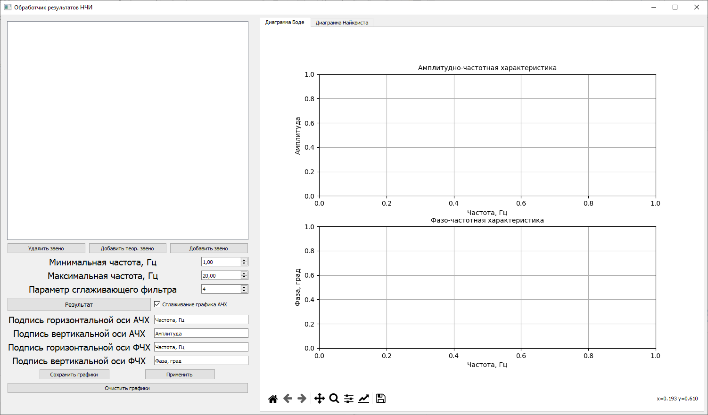
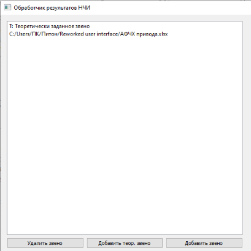
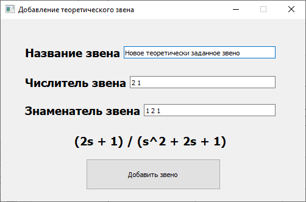
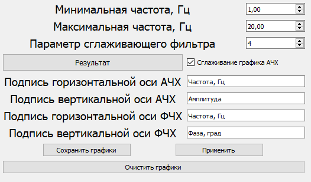
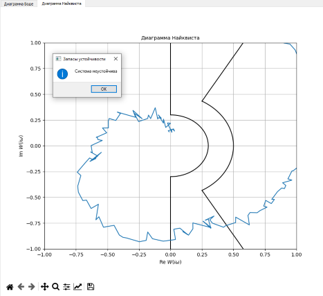

# my-bachelor-project
>Основная часть программы находится в директории ___project-files___. Для корректной работы программы необходимо наличие среды с используемыми здесь библиотеками.

___
Данный проект явлется практической частью бакалаврской выпускной квалификационной работы, которая называется «Обработка результатов наземных частотных испытаний контура "упругий летательный аппарат - комплексная система управления"»
___
Программа реализует графический интерфейс, позволяющий вычислять результат произведения передаточных функций, представленных либо теоретически заданными звеньями, либо частотными характеристиками, записанными в документе Excel или файле с расширением unv (примеры файлов располагаются в директрии ___test-data___, а основная программа и воспомогательные модули к ней находятся в директории ___project-files___)
***
Данная программа написана на языке ___Python 3.9.13___ с использованием следующих модулей и библиотек: 

    control, matplotlib, numpy, pandas, pyqt5, pyuff, scipy
# Объекты интерфейса
Общий интерфейс программы изображен ниже. Он "поделён" на несколько логически связанных частей: часть, обеспечивающая взаимодействие со списком передаточных функций; часть, позволяющая
регулировать отображение графиков; часть, где отображаются графики.

В левом верхнем углу находится список передаточных функций, произведение которых будет вычисляться. Ниже расположены кнопки для взаимодействия
с этим списком. Все адреса, содержащиеся в этом списке должны указывать путь к файлу, имеющий соответствующий формат(примеры таких файлов находятся в папке ___test-data___). Если данное условие не выполнено, результат получен не будет, и для исправления такой ситуации необходимо удалить некорректные для обработки пути.

При нажатии кнопки ___"Добавить теор. звено"___ появится дополнительное окно, где для добавления
теоретически заданного звена нужно ввести числитель и знаменатель в виде ряда из коэффициентов многочлена. Элементы ряда слева направо соотвествуют коэффициентам от старшего к младшему(под старшим коэффициентом нужно понимать коэффициент при старшей степени многочлена). Ниже добавлена визуализация получающегося звена.

Ниже в интерфейсе расположены элементы, отвечающие за отображение графиков. Минимальная и максимальная частоты
задают границы построения диаграмм, если они не превышают те, которые имеются в считываемых файлах.
При нажатии кнопки ___"Применить"___ подписи осей АЧХ и ФЧХ меняются в соответствии с указанными в полях. При нажатии кнопки ___"Сохранить графики"___
диаграммы Боде и Найквиста сохраняются в директорию проекта с размерами 16.5см*21см. Кнопка ___"Очистить графики"___ приводит части инерфейса, отвечающие за отображение результата к начальному виду.

При нажатии кнопки ___"Результат"___ на соответствующих вкладках отображаются диаграммы Боде и Найквиста. Для переключения между ними используются вкладки, расположенные выше. Снизу расположен "тулбар", который позволяет менять масштабы осей, приближать или отдалять участки графиков, менять их размеры и т.д.

 
